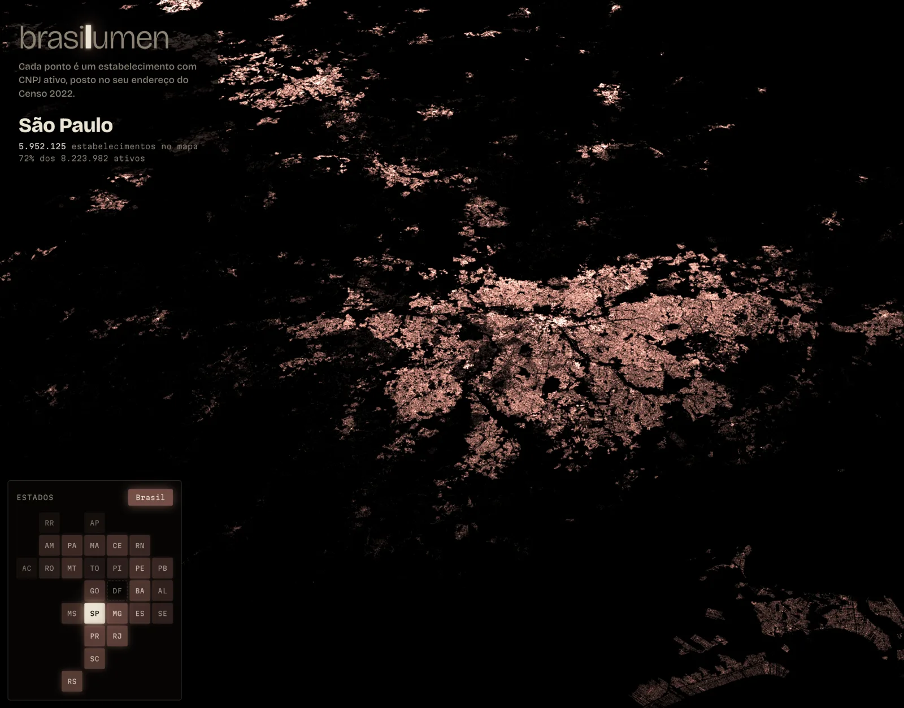

# brasilume

Cada ponto é um estabelecimento com CNPJ ativo, posto no seu endereço do Censo IBGE 2022.

**https://rafapolo.github.io/brasilume/** · link direto para um estado: `#sp`, `#rj`, `#ba`…



## Dados

- Estabelecimentos ativos do cadastro de CNPJ da Receita Federal.
- Geolocalização por casamento de endereço com o CNEFE (Censo IBGE 2022): logradouro e número,
  ou quadra e lote, sem recurso ao centroide do CEP nem da rua. O casamento entende o título da
  rua (PROFESSORA, CORONEL…), as abreviações da Receita e o CEP errado ou desatualizado, sempre
  exigindo o número ou lote exato; as regras estão em `rodado/scripts/extrai_estados_cnpj.py`.
  Quem não casa fica fora do mapa; `data/meta.json` traz, por UF, quantos dos ativos foram
  geolocalizados.
- Vários estabelecimentos no mesmo endereço viram um ponto só.
- `data/br.bin.gz` é uma amostra de 2 milhões de pontos para a vista do Brasil.
  Dando zoom nela, o mapa abre sozinho o estado sob o centro da tela, com todos os pontos, e segue
  o estado do centro ao cruzar a divisa. Quem diz o estado de cada lugar é `data/ufgrid.json`,
  uma grade de 0,2° gerada por `python3 scripts/ufgrid.py` a partir dos arquivos brutos do extrator
  (as caixas dos estados se sobrepõem, então não servem). Regere-a quando os dados mudarem.

### Formato de `data/<uf>.bin.gz`

Compactado por `scripts/repack.py` a partir da saída do extrator (`RAW2`: `n` longitudes
`float32`, `n` latitudes `float32`, `n` pesos `uint16`, `n` anos `uint8`): pontos numa grade de
1e-5° (~1,1 m), em ordem de Morton, gravados como deltas em varint e comprimidos com gzip, cerca
de 2,7× menor. O peso não é usado pelo mapa e fica de fora. O ano é o de abertura do
estabelecimento mais antigo daquele ponto, menos 1900 (aberturas anteriores a 1900 contam como
1900), e vai num terceiro bloco de `n` bytes. Rode `python3 scripts/repack.py` depois de extrair
dados novos; arquivos já compactados são ignorados, e os de layout sem ano (`BLP2`) pedem uma
nova extração.

O `br.bin.gz` usa uma grade 16× mais grossa (1,6e-4°, ~18 m). A vista do Brasil passa para um
estado por volta do zoom 8 mesmo numa tela 4K, onde um pixel tem ~1e-3°, então o desvio fica numa
fração de pixel (as capturas saem idênticas) e o arquivo cai de 6,0 para 3,9 MB. Cortar os bits
baixos das duas coordenadas mantém a ordem de Morton, então os arquivos de filtro continuam
alinhados; o `repack.py` engrossa no lugar um `br.bin.gz` que ainda esteja na grade fina.

### Setores (CNAE)

O seletor no painel do lugar filtra o mapa por setor: as 21 seções da CNAE 2.0 (A a U), tiradas da
divisão do CNAE principal de cada estabelecimento. Um endereço aparece num setor quando tem pelo
menos um estabelecimento nele. O extrator grava por ponto uma máscara de seções (`RAW3`), e
`scripts/repack.py` a separa em `data/<uf>.setores.bin.gz`, baixado só quando alguém filtra:
`BLS1`, `n`, `m`, depois `n` bytes com a seção do ponto (255 quando o endereço tem mais de uma) e,
em três planos de `m` bytes, as máscaras desses `m` pontos, na mesma ordem dos pontos do arquivo
principal. `meta.json` traz por UF, em `setores`, os ativos e os geolocalizados de cada seção. O setor
vai no link junto com o lugar: `#sp~g` é São Paulo, só comércio.

O segundo seletor filtra pela espécie do endereço no CNEFE (o que o recenseador viu no local em
2022: domicílio particular, domicílio coletivo, agropecuário, ensino, saúde, outras finalidades,
em construção, religioso). O extrator junta, por ponto, as espécies dos endereços do CNEFE na
mesma célula de ~11 m (`RAW4`), e `repack.py` grava `data/<uf>.especies.bin.gz`: `BLE1`, `n` e `n`
bytes de máscara (bit k = espécie k+1). Em `meta.json`, `especies` traz os estabelecimentos por
espécie e `cruzado` a tabela seção × espécie (o painel não a usa hoje). Os dois filtros valem um
de cada vez: escolher um limpa o outro. A espécie vai no link como número: `#sp~5` são os endereços
de saúde de São Paulo.

### Linha do tempo

O controle na base da tela esconde os pontos abertos depois do ano escolhido (1900 a 2025; mude
`TL_MAX` em `app.js` quando o extrator pegar um snapshot mais novo). Como o mapa só tem CNPJs
ativos hoje, ela mostra o que existe hoje e já existia naquele ano, não a cidade como era. Com o
ano recuado, o mapa desenha os pontos um a um, sem os níveis agrupados, porque uma célula
agrupada não sabe quantos dos seus pontos existiam em cada ano. O ano vai no link como último
campo do hash, `/ano`, só quando recuado.

## Código

Página estática, sem build: `index.html`, `app.js`, `app.css` e `worker.js` (download e
decodificação fora da thread principal). MapLibre GL com uma camada WebGL própria que desenha
cada estabelecimento como um ponto com mistura aditiva. De longe, onde centenas de pontos caem no
mesmo pixel, o worker junta os pontos de cada célula da grade num ponto só que carrega a contagem e
soma a mesma luz; a camada só usa um nível cujas células ficam abaixo de ⅓ de pixel, então a imagem
não muda. Com a câmera em movimento o limite sobe para 2 pixels: os centros mais claros perdem um
pouco do degradê, o que o movimento esconde, e São Paulo inteiro vai de ~25 para ~8 ms por quadro;
ao parar, o quadro é redesenhado exato. A luz automática também lê os níveis em vez dos pontos, e
com filtro tanto ela quanto o desenho usam só os pontos que passam nele. O cintilar redesenha o mapa
parado a 20 quadros por segundo.

O framebuffer tem 8 bits por canal e cada soma arredonda: sem cuidado, milhões de pontos fracos
arredondariam os canais para lados opostos e somariam vermelho ou amarelo puros nas bordas. O
shader arredonda cada contribuição ao acaso, na proporção da fração (dither), e cada canal fica
certo na média.

Ao mudar `app.js`, `app.css` ou `worker.js`, suba o `?v=` em `index.html` e em `app.js`, para o
cache do GitHub Pages não misturar versões. `thumbs/` são imagens estáticas de cada UF usadas na prévia do seletor.
`fonts/` traz as duas fontes (Bricolage Grotesque e Martian Mono, variáveis, subconjunto latino)
servidas daqui, com as licenças SIL OFL. `fonts/glyphs/bricolage/0-255.pbf` é a Bricolage no
formato de glifos do MapLibre, para os nomes das cidades: uma instância estática (peso 500,
`opsz` 14) tirada com o `fontTools.varLib.instancer` e convertida com `build_pbf_glyphs`
(`cargo install build_pbf_glyphs`); só o Latin-1, que cobre todos os nomes.

### Nomes das cidades

O botão **nomes** mostra o nome da sede de cada município. `data/cidades.json` sai de
`python3 scripts/cidades.py`: coordenadas das sedes do IBGE (tabela kelvins/municipios-brasileiros)
e população do Censo 2022 (SIDRA, tabela 4709). A população decide quem aparece primeiro e de mais
longe: as capitais desde a vista do Brasil, as cidades menores só de perto. No link, vai como
`~nomes` no primeiro campo do hash (`#sp~nomes/...`).

### Dados fora do git

`data/` não fica no repositório: mora no bucket privado `brasilumen` do Hetzner Object Storage.
O deploy (`.github/workflows/deploy.yml`) baixa o `data/` do bucket com as chaves dos secrets
`S3_ACCESS_KEY_ID` e `S3_SECRET_ACCESS_KEY` e publica o site inteiro no GitHub Pages, a cada push
para `main`. O hook `.githooks/pre-push` roda `scripts/sobe-dados.py` antes de cada push para `main`
e sobe para o bucket os arquivos de `data/` que mudaram, então o deploy sai com os dados atuais.
Uma vez por clone:

```sh
git config core.hooksPath .githooks
```

As credenciais ficam em `.env` (fora do git): `S3_ENDPOINT`, `S3_REGION`, `S3_BUCKET`,
`AWS_ACCESS_KEY_ID` e `AWS_SECRET_ACCESS_KEY`. `python3 scripts/sobe-dados.py --seco` mostra o que
subiria; `--apaga` remove do bucket o que saiu de `data/`.

Para rodar localmente, com o `data/` baixado do bucket:

```sh
aws s3 sync s3://brasilumen/data/ data/ --endpoint-url https://hel1.your-objectstorage.com
python3 -m http.server 8000
```
